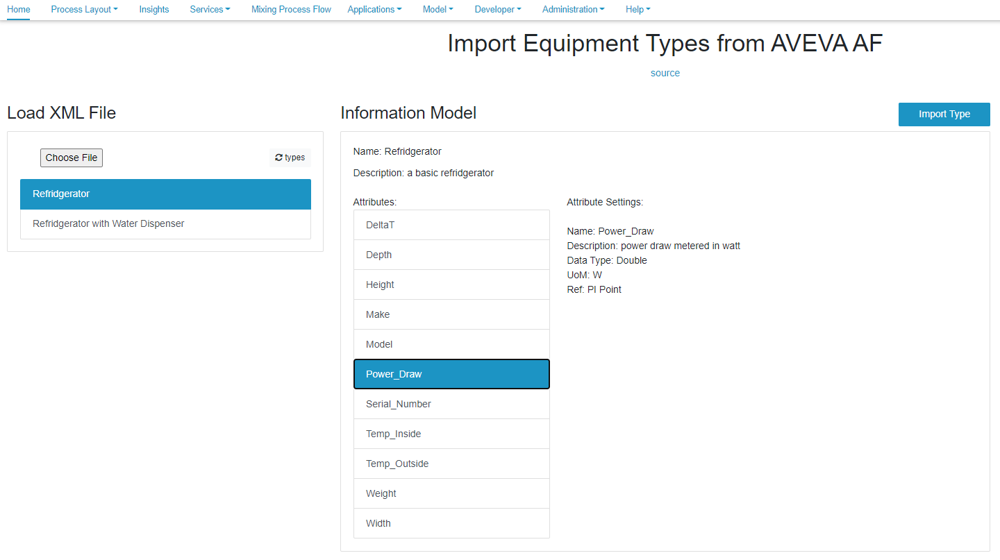
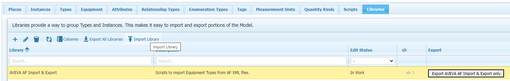

# SMIP2PIAF

This project includes a collection of browser scripts that allow the import of Asset Framework (AF) Element Types from AVEVA's PI System Explorer (PI AF) into the SMIP. Reverse functionality, i.e. exporting SMIP types so they can be imported into PI AF is supported also. Below is a screenshot of how Element Types can be imported into the SMIP:

<b>Fig.1 - Screenshot of UI to import Element Types</b>

To load this set of tools into a SMIP, simply import the library saved in this repo's release section.

<b>Fig.2 - Import Library to Load Smart App into SMIP</b>

## Modeling Techniques Supported in PI AF 

In PI AF we have only 2 types of objects that models are based upon: elements and attributes, both of which can be nested. Elements can be based on types, Element Templates, which are stored in a model library’s “Element Templates” section. An Element Template can be based of a single other Element Template. This allows inheritance and chaining of dependencies.

Even though element instances can be nested, element templates can not be nested, i.e. it is not possible to create composite types. Within an element template, however, attribute templates can be nested. For the purpose of importing AF element templates into the SMIP, we can either disregard nested attributes, or flatten them. Flattening nested attributes would preserve them for usage in the SMIP, but ultimately change the structure of the type, and possibly create issues with unique naming of sibling attributes.

## Element Tamplate Meta-Data

- Name - is captured.
- Description - is captured.
- Base Template - is captured by name (the base template needs to be imported first and be present in the SMIP).
- Type - only Elements are considered.
- Categories - omitted. This does not exist in the SMIP.
- Default Attribute - omitted. This does not exist in the SMIP.
- Naming Pattern - omitted. This does not exist in the SMIP.

## Attribute Template Meta-Data

- Name - is captured.
- Description - is captured.
- Properties - omitted. The are AF specific attributes.
- Categories - omitted. This does not exist in the SMIP.
- Default UoM - is captured by name. The is no mapping of UoM taxonomies.
- Default Value - is captured.
- Display Digits - omitted. This does not exist in the SMIP.
- Data Reference - only <none> (for static attributes) and PI Point (for tags) are captured.

### Value Type Mapping

Only basic types are captured. We omit array types, enums, and AF object references. 

AF types are mapped to SMIP types as follows:

- Boolean - bool
- Byte, Int16, Int32, Int64 - integer
- Single, Double - float
- String - string
- GUID - string
- DateTime - DateTime

